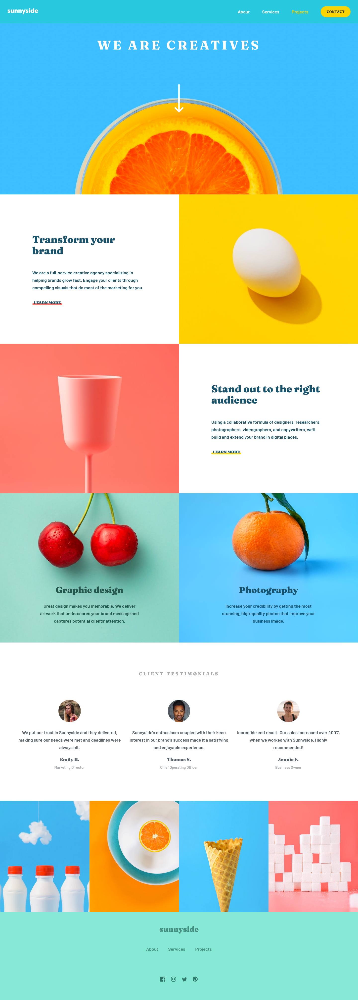

# Frontend Mentor - Sunnyside agency landing page solution

This is a solution to the [Sunnyside agency landing page challenge on Frontend Mentor]

### The challenge

Users will be able to:

- View the optimal layout for the site depending on their device's screen size
- See hover states for all interactive elements on the page

### Screenshot

### Links

- Solution URL: [Github Sunnyside Solution](https://github.com/olanrewajuyusuf/Sunnyside-agency-landing-page)
- Live Site URL: [Sunnyside Agency Netlify](https://wallewdev-sunnyside.netlify.app/)

## My process

Mobile first approach with css grid and flex layout.

### Built with

- Semantic HTML5 markup
- CSS custom properties
- Flexbox
- CSS Grid
- Mobile-first workflow

### Continued development

No challenge is simple, learning the proccess continues.

## Author

- Frontend Mentor - [@olanrewajuyusuf](https://www.frontendmentor.io/profile/olanrewajuyusuf)
- Twitter - [@WaliyyullahY](https://www.twitter.com/WaliyyullahY)

## Acknowledgments

Always giving kudos to frontend mentor and its crew. Thanks a lot. 
